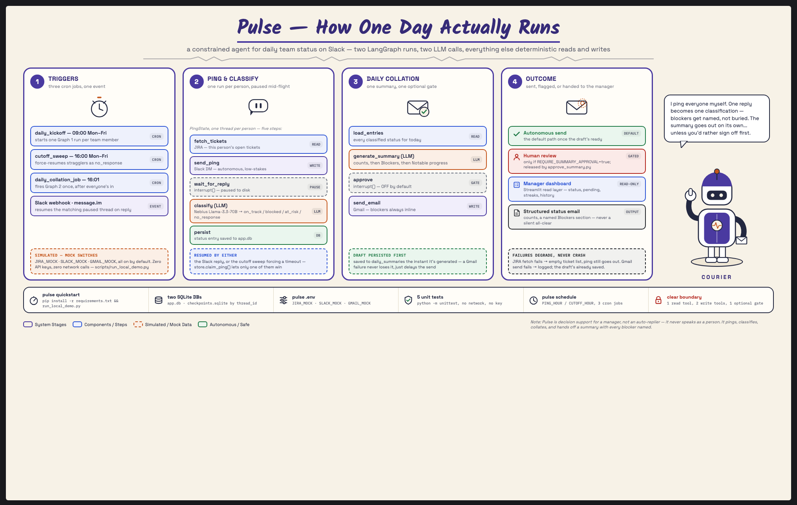

# Pulse

Team Status Collector & Manager Report Agent — Week 3 project (Mastering
Agentic AI, Track 2: LangChain + LangGraph). Pings
each team member individually about their open JIRA tickets, classifies
their Slack reply, and sends the manager a daily collated status email —
with blockers flagged.

**One-liner:** My agent helps an engineering manager get a daily team status
report on Slack, replacing the ~20 minutes a day spent DMing each person and
chasing blockers. It pulls each person's open JIRA tickets, pings them
individually, classifies their reply into on_track / blocked / at_risk /
no_response, and drafts a collated summary on its own using 4 tools (JIRA,
Slack, Gmail, an LLM classifier); it sends the summary email autonomously
but flags every blocker inline for the manager to act on. Success: the
manager gets an accurate daily summary by cutoff time without chasing
anyone themselves, 4 days out of 5.

## Architecture



Two LangGraph graphs, sharing one SQLite app DB plus a separate SQLite
checkpointer DB for paused-graph state.

```
Graph 1 — ping_and_classify (one run per person per day)
  fetch_tickets (JIRA, read) -> send_ping (Slack, write)
    -> [interrupt: wait for Slack reply, paused on disk via checkpointer]
    -> classify (LLM) -> persist (DB)

  Resumed by either:
    - src/webhook_app.py, when the person's Slack reply arrives
    - src/scheduler.py's cutoff_sweep job, which force-resumes any
      still-paused thread at the cutoff time with a "no_response" timeout

Graph 2 — daily_collation (one run per day, fired at cutoff time)
  load_entries (DB) -> generate_summary (LLM)
    -> [optional interrupt: manager approval, off by default]
    -> send_email (Gmail, write)
```

Why two graphs instead of one: Graph 1's wait for a human reply can take
minutes or hours per person, so each person gets their own independently
paused/resumed run. Graph 2 only needs to run once, after everyone's
statuses are in (or timed out).

## Human-in-the-loop decisions made explicit

- **JIRA fetch**: fully autonomous (read-only).
- **Slack ping**: fully autonomous (low-stakes recurring notification, not
  destructive). Change this if you disagree — gate it the same way as below.
- **Summary email send**: autonomous by default
  (`REQUIRE_SUMMARY_APPROVAL=false`), but every blocker is surfaced inline
  in the email itself so nothing is silently missed. Set
  `REQUIRE_SUMMARY_APPROVAL=true` to pause `daily_collation` before sending
  and require `scripts/approve_summary.py` to release it.

## Error handling

- JIRA fetch failure -> logs and falls back to an empty ticket list (the
  ping still goes out; it just doesn't show tickets) rather than crashing
  the whole daily run for one person.
- Slack send failure -> raised and logged per-person; `daily_kickoff` in
  `src/scheduler.py` catches it so one bad send doesn't stop the other
  pings.
- No reply by cutoff -> handled as a first-class state (`no_response`), not
  a failure — the `cutoff_sweep` job force-resumes the paused thread.
- Gmail send failure -> raised and logged; the draft summary was already
  persisted to `daily_summaries` before the send attempt, so nothing is
  lost and you can retry manually.

## Memory (Ask Pulse)

`status_entries` already accumulates one row per person per day — that
table *is* the persistent memory the project brief asks for. What was
missing was a way to query it in natural language instead of only
reading the dashboard's precomputed streaks.

`src/ask_pulse.py` closes that gap: it reads a rolling ~3-week window of
`status_entries` (`src/tools/memory_tool.py` — read-only, same autonomy
class as `jira_tool`) and hands that history to the LLM to answer a
free-form question ("who's stuck?", "how has Priya looked this week?"),
grounded only in what's actually in the DB — the prompt tells the model
not to invent people, dates, or tickets that aren't in it. No
`NEBIUS_API_KEY`? `_answer_heuristic` in `src/llm.py` answers the two
shapes the brief calls out (streaks, one person's history) without a
model call — same zero-setup fallback pattern as classification and
summary generation.

We didn't reach for a separate memory store (e.g. mem0): the history
that needs remembering already has a natural relational shape — one row
per person per day — that SQLite already owns, so a second store would
just be a second source of truth for the same facts. Ask Pulse is a read
query over that table, not a new one.

Try it from the manager dashboard's "Ask Pulse" box, or directly:

```python
from src.ask_pulse import ask
print(ask("who's been stuck for more than a couple of days?"))
```

## Quickstart (zero setup, zero API keys)

```bash
pip install -r requirements.txt
cp .env.example .env
python scripts/seed_team.py
python scripts/run_local_demo.py
```

This runs entirely on mocked JIRA/Slack/Gmail and a keyword-heuristic
classifier/summarizer (no `NEBIUS_API_KEY` needed), and prints the full
ping -> reply -> classify -> summary -> "sent" email flow to the console.
Use this as your day-1 checkpoint before wiring any real integration.

## Turning on real integrations (flip one flag at a time)

1. **Nebius classification/summary**: set `NEBIUS_API_KEY` in `.env` (and
   `NEBIUS_MODEL` if you want a different model than the default -- check
   the Nebius AI Studio console for the current catalog). `src/llm.py`
   automatically switches from the heuristic to a `ChatOpenAI` client
   pointed at Nebius's OpenAI-compatible endpoint. Classification asks the
   model for JSON directly and parses it (rather than LangChain's
   `with_structured_output`, which depends on tool-calling support that
   isn't guaranteed across every hosted model) -- if parsing ever fails, it
   logs a warning and falls back to the same heuristic used in mock mode.
2. **JIRA**: set `JIRA_MOCK=false` plus `JIRA_BASE_URL` / `JIRA_EMAIL` /
   `JIRA_API_TOKEN` in `.env`. `src/tools/jira_tool.py` has a `# TODO (Day 2)`
   marking the one line to change if you're on JIRA Server/DC (PAT bearer
   auth) instead of Cloud (basic auth).
3. **Slack**: set `SLACK_MOCK=false` plus `SLACK_BOT_TOKEN` /
   `SLACK_SIGNING_SECRET`. Run the webhook receiver:
   `uvicorn src.webhook_app:app --port 8000`, tunnel it (ngrok or similar),
   and point a Slack Events Subscription (`message.im`) at
   `https://<tunnel>/slack/events`.
4. **Gmail**: set `GMAIL_MOCK=false`, run through the OAuth consent flow
   once to produce `token.json` (scope: `gmail.send`), point
   `GMAIL_MANAGER_ADDRESS` at the real recipient.
5. **Scheduler**: `python -m src.scheduler` runs the three cron jobs
   (`daily_kickoff`, `cutoff_sweep`, `daily_collation_job`) — keep it
   running alongside the webhook receiver for real day-to-day operation.

## Manager dashboard

```bash
streamlit run streamlit_app.py
```

A read layer over the same `src/db` and `src/graphs` the rest of the app
uses — no new backend, no HTTP API of its own. Shows: today's per-person
status, who's still waiting on a reply, blocked/at-risk streaks (2+ days
running), an "Ask Pulse" chat box for natural-language questions over
status history (see Memory above), history of past summaries, and three
buttons (`Run daily kickoff`, `Run cutoff sweep`, `Run collation`) so you
can drive the whole pipeline from the UI instead of the CLI — useful for
the demo recording. If `REQUIRE_SUMMARY_APPROVAL=true`, a
pending-approval panel appears with an editable draft and
Approve/Send-edited buttons.

## Project layout

```
src/
  config.py            env vars + mock switches, one place
  llm.py                classify_reply / generate_summary / answer_question (+ zero-key fallback)
  ask_pulse.py          natural-language Q&A over status history (Memory, see above)
  db/
    models.py           TeamMember, StatusEntry, DailySummary, OpenPing
    store.py             all DB access
  tools/
    jira_tool.py         read-only
    slack_tool.py         ping send + webhook signature verification
    gmail_tool.py          summary send
    memory_tool.py         read-only queries over status history, for ask_pulse.py
  graphs/
    ping_and_classify.py  Graph 1
    daily_collation.py    Graph 2
  scheduler.py          daily_kickoff / cutoff_sweep / daily_collation_job cron
  webhook_app.py        FastAPI receiver for Slack replies
scripts/
  seed_team.py          load data/team_members.sample.json into the DB
  run_local_demo.py     full mocked end-to-end run, no setup required
  approve_summary.py    resume a paused daily_collation run (if approval gate is on)
tests/
  test_classify.py      heuristic classifier/summarizer unit tests
  test_ask_pulse.py      heuristic Ask Pulse unit tests
data/
  team_members.sample.json
  mock_tickets.json
streamlit_app.py       manager dashboard (today's status, pending, streaks, Ask Pulse, history)
```

## Known scope cuts (call these out as future work in the project doc)

- Teams support (originally scoped, now Slack-only per the current plan).
- Blocker auto-resolution / suggesting who to loop in (stretch goal).
- Postgres instead of SQLite (drop-in swap in `src/db/store.py`'s engine URL
  and the two `sqlite3.connect(...)` calls in the graph modules; not needed
  at this scale).
